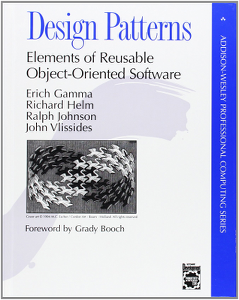

============================
O que são Design Patterns
============================

**ATUALIZAÇÃO**: Fiz um `vídeo de 8 minutos <https://www.youtube.com/watch?v=K7loVvk8Dyg>`_ onde apresento conceitos de **design patterns** usando blocos de LEGO® e outros exemplos.

*Design patterns* ou *padrões de projeto* são formas de organizar as partes de um programa para resolver determinados problemas promovendo a flexibilidade e a adaptabilidade do sistema a novas demandas.

Por exemplo, o design pattern **Iterator** (**Iterador**) recomenda a criação de uma classe especializada para percorrer uma coleção de objetos, oferecendo uma interface padrão (por exemplo, um método ``next``) de forma que as outras classes do programa que precisam percorrer os itens da coleção não precisam saber como ela é implementada; elas só precisam chamar o método ``next``. Isso permite também trocar a implementação da coleção e modificar apenas o **Iterador**, sem ter que alterar o código das partes do programa que utilizam o **Iterador**.

Após muitos anos estudando e praticando programação orientada a objetos, quatro professores (Erich Gamma, John Vlissides, Ralph Johnson, e Richard Helm) escreveram o livro *Design Patterns: Elements of Reusable Object-Oriented Software* (*Padrões de Projeto - Soluções Reutilizaveis de Software Orientado a Objetos*). Os quatro autores ficaram conhecidos como a "Gangue dos Quatro" e o livro às vezes é citado como *GoF* (Gang of Four).

No livro *Design Patterns* eles não inventaram nenhum padrão novo, mas sim definiram uma metodologia para documentar padrões existentes, e aplicaram a metodologia documentando e nomeando 23 padrões específicos.

Descrever os padrões e dar nomes a eles foi uma grande contribuição, porque agora podemos falar "vamos implementar um **Iterator**" em vez de "vamos implementar uma classe com um método ``next`` que vai ser instanciada pela coleção e vai cuidar do estado de uma iteração com um cliente e blá, blá blá, blá...".

Aprender padrões de projeto é uma forma de aperfeiçoar suas habilidades para construir sistemas orientados a objetos.

----

**Nota**: O design pattern **Iterator** já vem embutido na linguagem Python, portanto programadores Python não precisam implementá-lo. Mesmo assim, o entendimento do design pattern original ajuda a entender o potencial e os casos de uso dos iteradores embutidos na linguagem. Outros design patterns são simplificados em Python, se comparados a implementações clássicas em C++ ou Java.

----

Para aprender padrões de projeto na prática, usando a linguagem Python, faça o curso **Python Patterns** com Luciano Ramalho. A primeira turma **presencial** será São Paulo no fim de semana de 15 e 16 de agosto de 2015 (`inscrições <http://j.mp/ppp-sao>`_). A primeira turma **online** começa em 29 de julho de 2015, às 20h (`instruções <https://adm.python.pro.br/cursos/python-patterns>`_). 

